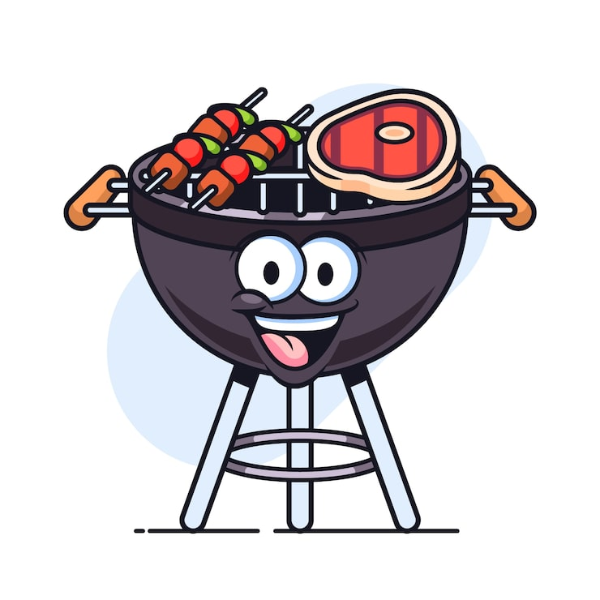

# Git BBQ



Git BBQ is a Go-first scaffolding and repository-lifecycle tool for coding
agents. It creates durable project context, Matt-native ADRs, language skills,
Codex hooks, deterministic projections, and explicit Git workflow policy.

Git BBQ does not call a model. The host agent performs architecture reasoning;
Git BBQ owns project bootstrap, validation, projections, lifecycle hooks, and
approval-gated Git operations.

## Quick start: Secure-Web-Printer

Here is a deliberately practical example. Imagine you are starting
Secure-Web-Printer, a Go HTTPS server with an embedded Let's Encrypt ACME
requester, HTMX and Markdown templates, and release builds for macOS, Linux,
and Windows on both x86_64 and ARM64.

Compile Git BBQ first, then use the resulting binary for the project workflow:

~~~sh
go build -o ./git-bbq ./cmd/git-bbq

./git-bbq init \
  --name Secure-Web-Printer \
  --problem "Build Secure-Web-Printer, a Go HTTPS server with an embedded Let's Encrypt ACME requester, HTMX and Markdown templates, and release binaries for aarch64-darwin, gnu-linux-x86_64, gnu-linux-aarch64, Windows x86_64, and Windows aarch64." \
  --language go \
  ./Secure-Web-Printer

./git-bbq adr new \
  --title "Set Secure-Web-Printer release targets" \
  --context "Secure-Web-Printer needs one release matrix for its Go HTTPS server across macOS arm64, Linux x86_64 and arm64, and Windows x86_64 and arm64." \
  --decision "Use darwin/arm64 (aarch64-darwin), linux/amd64 (gnu-linux-x86_64), linux/arm64 (gnu-linux-aarch64), windows/amd64 (Windows x86_64), and windows/arm64 (Windows aarch64)." \
  --why "The names make the release promise readable while Go's GOOS and GOARCH pairs keep builds reproducible." \
  ./Secure-Web-Printer

./git-bbq project ./Secure-Web-Printer
./git-bbq validate ./Secure-Web-Printer
~~~

This example records the release targets; it does not pretend that Git BBQ has
a target flag or that it writes the HTTPS server for you. The application code,
Go module, ACME integration, templates, and release pipeline still belong to
Secure-Web-Printer.

### What the example creates

`init` creates the project contract and agent-facing files. `adr new` adds the
first decision. `project` creates the deterministic projections, and `validate`
checks the result without adding another decision history.

After the full sequence above, the project contains:

~~~text
Secure-Web-Printer/
├── .agents/
│   ├── mattpocock/DEPENDENCY.yaml
│   └── skills/
│       ├── githabits/SKILL.md
│       └── go/SKILL.md
├── .gitbbq/
│   ├── .gitignore
│   ├── hooks.json
│   ├── ownership.json
│   └── session.json
├── .gitbbq-manifest.yaml
├── .githabits.yaml
├── AGENTS.md
├── CONTEXT-MAP.md
├── CONTEXT.md
├── architecture-contract.yaml
├── docs/
│   └── adr/
│       ├── 0001-set-secure-web-printer-release-targets.md
│       └── index.json
└── implementation-plan.md
~~~

The useful distinction is between decisions and projections:

- `CONTEXT.md` and `CONTEXT-MAP.md` hold the project's vocabulary and context
  routing.
- `AGENTS.md` points the host agent at those project rules.
- `.gitbbq-manifest.yaml` records the problem, language profile, pinned Matt
  dependency, and required hooks.
- `.githabits.yaml` makes Git behavior explicit instead of leaving it to an
  agent's assumptions.
- `docs/adr/0001-...md` is the human-readable architectural decision.
- `architecture-contract.yaml`, `implementation-plan.md`, and
  `docs/adr/index.json` are generated views of the source documents.
- `.gitbbq/ownership.json`, `.gitbbq/hooks.json`, `.gitbbq/session.json`, and
  `.gitbbq/.gitignore` track Git BBQ's generated operational state.

### The five release targets

The readable product names map to Go's GOOS and GOARCH values like this:

| Release label | GOOS | GOARCH |
| --- | --- | --- |
| aarch64-darwin | darwin | arm64 |
| gnu-linux-x86_64 | linux | amd64 |
| gnu-linux-aarch64 | linux | arm64 |
| Windows x86_64 | windows | amd64 |
| Windows aarch64 | windows | arm64 |

Once the project has a `go.mod` and an application entry point, its release
commands can be as plain as:

~~~sh
mkdir -p dist
GOOS=darwin GOARCH=arm64 go build -o dist/Secure-Web-Printer-aarch64-darwin ./...
GOOS=linux GOARCH=amd64 go build -o dist/Secure-Web-Printer-gnu-linux-x86_64 ./...
GOOS=linux GOARCH=arm64 go build -o dist/Secure-Web-Printer-gnu-linux-aarch64 ./...
GOOS=windows GOARCH=amd64 go build -o dist/Secure-Web-Printer-windows-x86_64.exe ./...
GOOS=windows GOARCH=arm64 go build -o dist/Secure-Web-Printer-windows-aarch64.exe ./...
~~~

Those build commands are application work. Git BBQ's job is to make the
decision and its surrounding project context visible before that work begins.

## Project contract

A Git BBQ project uses:

- `CONTEXT.md` and `CONTEXT-MAP.md` for project vocabulary;
- `docs/adr/` as the architectural decision source of truth;
- `.gitbbq-manifest.yaml` for project and dependency metadata;
- `.githabits.yaml` for explicit Git lifecycle policy;
- `.agents/skills/` for githabits and selected language skills;
- generated `architecture-contract.yaml`, `implementation-plan.md`, and
  `docs/adr/index.json` projections.

The detailed contract is in [docs/GIT_BBQ.md](docs/GIT_BBQ.md).

## Codex plugin

Build the standalone Codex package, including its portable manifest,
compatibility manifest, launchers, and short-lived Go runtimes:

```sh
python3 scripts/build_git_bbq_plugin.py \
  --output plugins/git-bbq \
  --target all \
  --force
python3 scripts/validate_git_bbq_plugin.py plugins/git-bbq
```

The package contains exactly five lifecycle hooks and embeds the `git-bbq`
runtime for the four supported targets. Matt skills are copied from the exact
pinned upstream commit, filtered to the ADR, architecture, code, and document
revision allowlist, rewritten for Codex, and normalized to US English.

To make it available in Codex CLI and ChatGPT desktop:

```sh
codex plugin marketplace add .
codex plugin add git-bbq@git-bbq-local
codex plugin list
```

Restart the Codex host after rebuilding the package. In Codex CLI, run `/hooks`
to review and trust the bundled lifecycle definition, then test in a new
thread. See
[docs/LOCAL_PLUGIN.md](docs/LOCAL_PLUGIN.md) and
[docs/PLUGIN_SUBMISSION.md](docs/PLUGIN_SUBMISSION.md).

## Development

```sh
gofmt -w cmd internal
go test ./...
go vet ./...
go build ./cmd/git-bbq
go run ./cmd/git-bbq schema .
```

Generated schemas under `schemas/gitbbq/` are derived from Go contracts and
must not be hand-edited.

## Safety boundaries

Git BBQ treats repository contents as untrusted data, keeps static inspection
bounded, preserves existing files by default, and separates read-only plans
from approved Git mutations. It never force-pushes, rewrites shared history, or
silently creates a remote.
