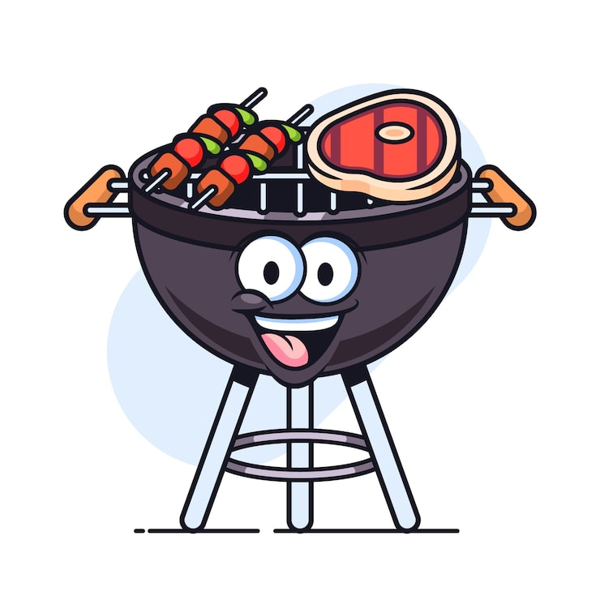

# Git BBQ



Git BBQ carries an agent's architecture work from the conversation into the
repository. It builds on Matt Pocock's upstream engineering skills, including
their grill-me approach: ask pointed questions that surface assumptions before
they become surprises in a pull request. Git BBQ records the resulting context
and architecture decisions, gives agents language-specific project guidance, and
makes Git permissions explicit. The grill catches vague requirements; the
repository should remember what the team decided.

Git BBQ is a Go CLI and a Codex plugin. It does not call a model or write your
application. Your host agent does the reasoning and implementation. Git BBQ
keeps the project brief, decisions, generated architecture views, validation,
and approved Git operations organized around that work. It will not build your
storefront, but it can help keep checkout decisions from disappearing into the
chat scrollback.

## Quick start: a Next.js store

Start with the product brief you would give a coding agent. This example
scaffolds the repository for a TypeScript Next.js project and records one
payment decision:

```sh
go build -o ./git-bbq ./cmd/git-bbq

./git-bbq init \
  --name storefront \
  --problem "Create a modern Next.js e-commerce site, complete with product reviews, testimonials, a product catalog, a shopping cart, and Stripe payments. Include a chatbot popup window for automated customer service, and a modal offering 15% off in exchange for an email address." \
  --language typescript \
  ./storefront

./git-bbq adr new \
  --title "Use Stripe for checkout payments" \
  --context "The store needs online payments, and the browser must not own payment credentials or decide whether an order is paid." \
  --decision "Use Stripe for checkout. Keep Stripe credentials on the server and mark orders paid only after verifying Stripe's payment event." \
  --why "The server boundary protects payment credentials, and a verified payment event gives order fulfillment a reliable signal." \
  ./storefront

./git-bbq project ./storefront
./git-bbq validate ./storefront
```

Git BBQ writes the project brief and TypeScript profile into its project
scaffold, saves the Stripe choice as a Matt-native ADR, and generates the
architecture contract, implementation plan, and ADR index. The chatbot, store,
promotions, and payment integration remain application work for your coding
agent and team. Git BBQ is the sous-chef for project memory, not a JavaScript
framework wearing an apron.

After these commands, the repository includes:

```text
storefront/
├── .agents/
│   ├── mattpocock/DEPENDENCY.yaml
│   └── skills/
│       ├── githabits/SKILL.md
│       └── typescript/SKILL.md
├── .gitbbq/
│   ├── .gitignore
│   ├── hooks.json
│   ├── ownership.json
│   └── session.json
├── .gitbbq-manifest.yaml
├── .githabits.yaml
├── AGENTS.md
├── CONTEXT-MAP.md
├── CONTEXT.md
├── architecture-contract.yaml
├── docs/adr/
│   ├── 0001-use-stripe-for-checkout-payments.md
│   └── index.json
└── implementation-plan.md
```

`CONTEXT.md`, `CONTEXT-MAP.md`, and `docs/adr/` hold the project's durable
context and decisions. `.gitbbq-manifest.yaml` records the project problem,
language selection, Matt dependency, and hook requirements. `AGENTS.md` routes
an agent to those instructions. The architecture contract, implementation
plan, and ADR index are generated projections, so there is one decision history
to maintain. `.githabits.yaml` describes the Git actions the project allows.

## How Git BBQ fits the workflow

Matt's skills help an agent investigate a problem and work through architecture
questions. Git BBQ gives that work a home in the repository. The host agent
still chooses the design and writes application code; Git BBQ provides the
scaffold, durable records, and checks around it.

### Language profiles and scaffolding

Git BBQ supports Go, Python, TypeScript, JavaScript, Rust, Java, and C#. During
interactive setup it detects candidates, shows evidence paths, lets you edit
the full language set, and asks for confirmation before writing. An explicit
`--language` selection takes precedence. Non-interactive setup uses a saved
project or user selection; if neither exists, it reports candidates and stops
without writing.

Language profiles add focused guidance to `AGENTS.md`, language skills, and
`implementation-plan.md`. The generated project's `CONTEXT.md` and
`CONTEXT-MAP.md` formats remain stable. Start with `git-bbq init --interactive`
when you want the CLI to propose a language set for review.

### Validation and architecture projections

`git-bbq validate` checks the project manifest, ADRs, hook policy, and generated
architecture projections. It reports projection drift and scans bounded
architecture and Git-policy files for secret-like values. Findings identify a
file, line, and finding type without printing the detected value.

`git-bbq project` regenerates the architecture contract, implementation plan,
and ADR index from the manifest and Matt-native ADRs. Those generated files
help tools consume decisions consistently; they are not another place to edit
the project's architecture.

### Migrating an AI Software Architect project

Migration begins with a read-only assessment:

```sh
git-bbq migrate ./existing-project
```

Review its proposed files and conflicts before applying it:

```sh
git-bbq migrate --approve ./existing-project
```

The migration converts supported language and problem fields and compatible
architecture decisions into Git BBQ's current project and Matt-native ADR
formats. It preserves the legacy files. Replacing an incompatible legacy
`.githabits.yaml` also requires `--archive-legacy-githabits`, which keeps the
original file in the migration archive. See the
[legacy migration guide](docs/agents/legacy-migration.md) for conversion rules.

### Git actions require a plan and approval

Git BBQ separates read-only planning from execution. A plan checks project
policy and shows the exact argument-separated Git command. Execution requires
`--approve` and rechecks the policy before running it:

```sh
git-bbq githabits plan --action stage --path docs/adr/0001-use-stripe-for-checkout-payments.md

git-bbq githabits execute \
  --approve \
  --action stage \
  --path docs/adr/0001-use-stripe-for-checkout-payments.md
```

The `manual` and `guided` profiles do not authorize Git mutations by default.
The `autonomous` profile enables individual action switches, but execution
still requires explicit approval. Git BBQ does not force-push or rewrite shared
history.

## Codex plugin

The local plugin package includes the portable manifest, Codex compatibility
manifest, curated skills, Go CLI runtimes, launchers, and five lifecycle hooks:
`UserPromptSubmit`, `PreToolUse`, `PostToolUse`, `PostCompact`, and `Stop`.
Hooks run only through the local Codex host. Review and trust them with `/hooks`
after installation.

Build and validate the local package:

```sh
python3 scripts/build_git_bbq_plugin.py \
  --output plugins/git-bbq \
  --variant local \
  --target all \
  --force
python3 scripts/validate_git_bbq_plugin.py plugins/git-bbq --variant local --target all
```

The builder pins the curated engineering and productivity skills to the exact
upstream commit recorded by the `.agents/skills` submodule. Curation belongs to
Git BBQ; upstream skill instructions and support files remain upstream content.

Build the hook-free, public-oriented package for submission preflight with
`--variant public`. It retains the selected skills and local CLI runtime, but
cannot give a ChatGPT web install access to the user's repository or execute a
local CLI. A hook-free build addresses the hook packaging constraint; it does
not guarantee marketplace acceptance. Read the
[plugin submission guide](docs/PLUGIN_SUBMISSION.md) before preparing a public
submission.

To install this repository's local marketplace in Codex:

```sh
codex plugin marketplace add .
codex plugin add git-bbq@git-bbq-local
codex plugin list
```

Restart the Codex host after rebuilding a package, then review the hook
configuration in a new thread. See the
[local plugin guide](docs/LOCAL_PLUGIN.md) for installation and troubleshooting.

## Development

The CLI and project behavior live in `cmd/git-bbq` and `internal/gitbbq`.
Portable plugin packaging and Codex-specific integration live under
`adapters/codex` and `scripts/`.

```sh
test -z "$(gofmt -l cmd internal)"
go test ./...
go vet ./...
go build ./cmd/git-bbq
PYTHONPATH=scripts python3 -m unittest scripts/test_build_git_bbq_plugin.py
go run ./cmd/git-bbq schema .
```

Generated schemas under `schemas/gitbbq/` come from Go contracts and must not
be edited by hand. The [development guide](docs/DEVELOPMENT.md) describes the
package build and upstream skill update workflows.

## Safety boundaries

Git BBQ treats repository contents as untrusted data, bounds static inspection,
preserves existing files by default, and separates plans from approved Git
mutations. It never creates a remote silently. Existing project files stay in
place unless the user approves an operation that changes them.

## Documentation

- [Project behavior and file contracts](docs/GIT_BBQ.md)
- [Local Codex installation](docs/LOCAL_PLUGIN.md)
- [Development and packaging](docs/DEVELOPMENT.md)
- [Legacy project migration](docs/agents/legacy-migration.md)
- [Public plugin submission preflight](docs/PLUGIN_SUBMISSION.md)
